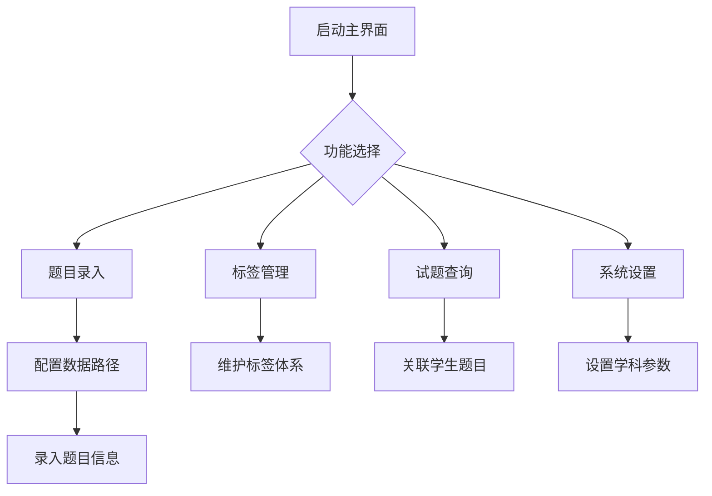

# MobiusJ V0.0.2 功能说明

## 核心功能模块

### 1. 主界面 (main.py)
- 提供四个核心功能入口按钮
- 界面布局：
  ```python
  [题目录入] [标签管理] [试题查询] [设置]
  [           退出           ]
  ```
- 启动参数：900x600窗口尺寸
- 依赖模块：feature1~4

### 2. 题目录入 (feature1.py)
- 核心功能：
  - 题目ID录入（支持剪贴板粘贴）
  - 标签多选（支持名称搜索/双击选择）
  - 难度等级设置（1-4级）
  - 标签创建（含模块选择/类型定义）
- 数据存储：
  - 题目数据保存至 `item_data.txt`
  - 格式：`题目ID|难度|标签ID1;标签ID2...`
- 特色功能：
  - 实时标签题量统计
  - 输入内容格式验证
  - 自动补全模块ID(4位)和标签ID(5位)

### 3. 标签管理 (feature2.py)
- 主要功能：
  - 多维筛选（模块/类型/名称）
  - 标签信息编辑（模块/类型/名称/介绍）
  - 题量关联统计
- 数据文件：
  - `tag_data.txt` 存储格式：
    `标签ID|模块ID|标签名称|标签类型|标签介绍`
  - `module_data.txt` 存储格式：
    `模块ID|模块名称`
- 管理特性：
  - 支持批量修改
  - 修改内容实时同步
  - 唯一性校验

### 4. 试题查询 (feature3.py)
- 核心功能：
  - 学生选择与信息展示
  - 多条件组合查询：
    - 模块树形筛选
    - 标签类型过滤（常规/困难/疯狂）
    - 名称模糊搜索
  - 题目操作：
    - 浏览器直达题目详情页
    - 题目-学生关联管理
- 数据显示：
  - 表格包含：模块/类型/题名/难度/ID/关联次数
  - 支持双击查看题目详情
- 数据源：
  - `student_data.txt` 格式：
    `学生ID|姓名|题目ID1;题目ID2...`

### 5. 系统设置 (feature4.py)
- 配置项：
  - 数据存储路径（必需）
  - 学科参数（用于生成题目URL）
- 功能特性：
  - 路径有效性验证
  - 数据文件格式检查：
    - student_data.txt
    - item_data.txt 
    - tag_data.txt
    - module_data.txt
  - 配置异常处理：
    - 自动创建缺失目录
    - 配置项双重验证
- 存储方式：
  - JSON格式保存至 `settings.json`

## 数据文件规范
| 文件名            | 格式说明                                  | 示例                      |
|-------------------|-----------------------------------------|--------------------------|
| student_data.txt  | 学生ID|姓名|关联题目ID列表         | S1001|张三|Q123;Q456    |
| item_data.txt     | 题目ID|难度|关联标签ID列表          | Q123|2|T1001;T1002  |
| tag_data.txt      | 标签ID|模块ID|名称|类型|介绍       | T1001|M01|几何|常规|平面几何...|
| module_data.txt   | 模块ID|模块名称                          | M01|函数与方程           |
| settings.json     | 数据路径/学科参数等系统配置               | {"data_path": "...", ...}|

## 使用流程

## 其他相关文档
- 功能架构说明：【boardmix】Mobi-MobiusJ-V0.0.2
- Promot：【Obsidian】Mobius-4-代码脚本-promot-Mobius J V0.02